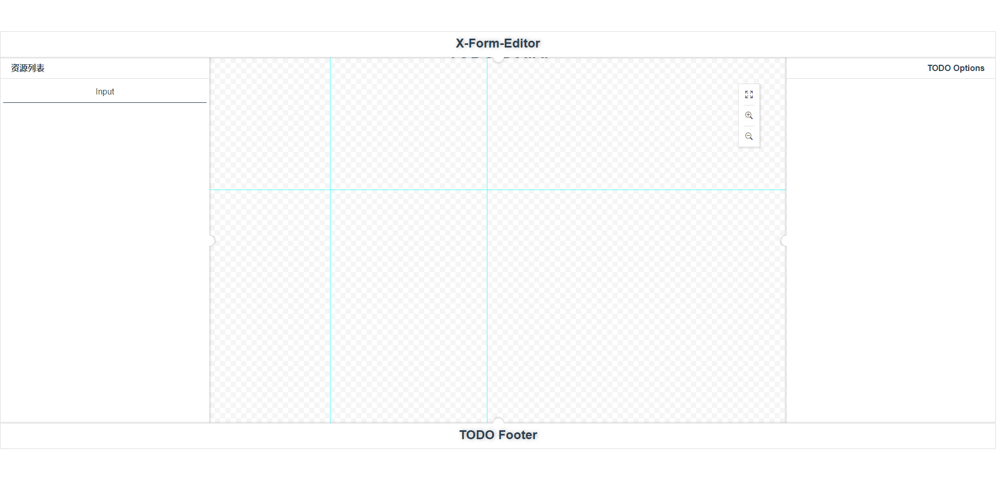
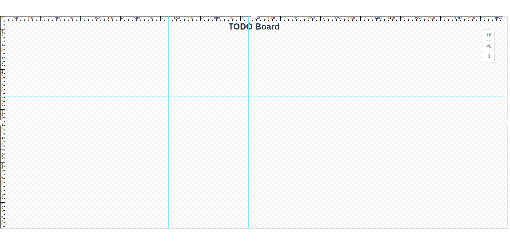

# X-Form-Editor-Vue

> A form editor plugin based on vue.

## Example

``` bash
# install dependencies
npm install

# serve with hot reload at localhost:8080
npm run dev
```

## Preview





## Use

```bash

```

## TODO
- [x] 实现FormEditor基础骨架
- [x] 完善配置，支持自定义基础组件
- [ ] 完善基础组件
- [ ] 完善example
- [ ] npm 发布


## License
[MIT](http://opensource.org/licenses/MIT)
